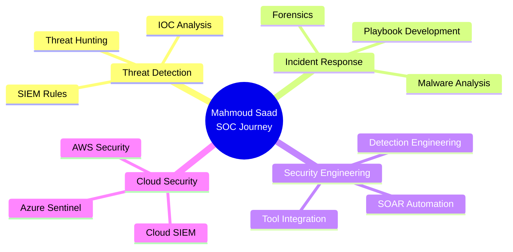

<div align="center">
  
</div>

<div align="center">
  
  <!-- Typing Animation -->
  

  <br>

  <!-- Profile Views & Social -->
  
  
  [](https://www.linkedin.com/in/mahmoudsaad10/)
  [](mailto:mahmoudsaad10@gmail.com)
  [](https://tryhackme.com/p/yourusername)

</div>

---

## 🎯 About Me

```python
class SOCAnalyst:
    def __init__(self):
        self.name = "Mahmoud Saad"
        self.role = "SOC Analyst & Threat Hunter"
        self.location = "Egypt 🇪🇬"
        self.currently_learning = [
            "Advanced Threat Detection",
            "SIEM Engineering",
            "Malware Analysis",
            "Digital Forensics"
        ]
        
    def get_skills(self):
        return {
            "Blue Team": ["Incident Response", "Threat Hunting", "Log Analysis"],
            "Tools": ["Splunk", "Wazuh", "Elastic SIEM", "Wireshark"],
            "Scripting": ["Python", "Bash", "PowerShell"],
            "Platforms": ["Linux", "Windows Server", "Cloud Security"]
        }
    
    def current_mission(self):
        return "🎯 Transforming security alerts into actionable intelligence"

analyst = SOCAnalyst()
print(analyst.current_mission())
# Output: 🎯 Transforming security alerts into actionable intelligence
```

<div align="center">
  
### 💡 *"Security is not a product, but a process"* - Bruce Schneier

</div>

---

## 🚀 Featured Projects

<div align="center">

<table>
<tr>
<td width="50%">

### 🚨 [Incident Response Reports](https://github.com/MahmoudSaad10/Portfolio/tree/main/Incident%20Response%20Reports)

Real-world IR scenarios documenting the complete incident lifecycle:
- 🔍 Initial detection & triage
- 🎯 IOC identification 
- ⚡ Containment strategies
- 🛡️ Eradication & recovery
- 📊 Post-incident analysis


</td>
<td width="50%">

### 🛡️ [SOC Labs & Challenges](https://github.com/MahmoudSaad10/Portfolio/tree/main/SOC%20Labs)

Hands-on detection engineering labs:
- 📡 SIEM rule development
- 🎣 Threat hunting scenarios
- 🔎 Log correlation techniques
- ⚙️ Alert tuning & optimization
- 📈 Dashboard creation


</td>
</tr>

<tr>
<td width="50%">

### 🎣 [Phishing Analysis](https://github.com/MahmoudSaad10/Portfolio/tree/main/Phishing%20Analysis)

Deep-dive email security investigations:
- 📧 Email header analysis
- 🔗 Malicious URL dissection
- 💾 Payload examination
- 🎭 Attack pattern recognition
- 🛠️ Detection rule creation


</td>
<td width="50%">

### 📡 [Security Automation](https://github.com/MahmoudSaad10/Portfolio/tree/main/Network%20Monitoring%20Scripts)

Python automation for SOC workflows:
- 🤖 Automated log collection
- 🌐 Suspicious IP enrichment
- 📊 Alert aggregation scripts
- 🔔 Notification systems
- 📈 Metrics dashboards


</td>
</tr>
</table>

</div>

---

## 🛠️ Technical Arsenal

<div align="center">

### 🔵 Blue Team Stack

<table>
<tr>
<td align="center" width="25%">
<br>
<b>SIEM Platform</b>
</td>
<td align="center" width="25%">
<br>
<b>EDR & XDR</b>
</td>
<td align="center" width="25%">
<br>
<b>Log Analytics</b>
</td>
<td align="center" width="25%">
<br>
<b>Packet Analysis</b>
</td>
</tr>
</table>

### 💻 Development & Scripting


### 🖥️ Operating Systems & Platforms


### 🎓 Learning Platforms


</div>

---

## 📊 GitHub Analytics

<div align="center">
  
  
  

  <br><br>

  
  

</div>

<div align="center">
  
  ### 🏆 GitHub Trophies
  
  

</div>

---

## 🎓 Certifications & Training

<div align="center">

| 🏅 Certification | 📅 Status | 🎯 Focus Area |
|-----------------|-----------|---------------|
| **Google Cybersecurity Professional** | ✅ Completed | SOC Fundamentals |
| **(ISC)² Certified in Cybersecurity (CC)** | ✅ Completed | Security Principles |
| **TryHackMe SOC Level 1** | ✅ Completed | Threat Detection |
| **TryHackMe SOC Level 2** | ✅ Completed | Advanced Analysis |
| **Blue Team Level 1 (BTL1)** | ✅ Completed | Blue Team Ops |
| **CompTIA Security+** | 🔄 In Progress | Security+ |
| **Microsoft SC-200** | 🔄 In Progress | Security Operations |

</div>

---

## 📈 Current Focus

<div align="center">



</div>

---

## 💭 Random Cyber Quote

<div align="center">
  
  

</div>

---

## 📫 Let's Connect!

<div align="center">

I'm always open to collaborating on cybersecurity projects, discussing security topics, or sharing knowledge!

**💬 Reach out for:**
- 🤝 Collaboration on security projects
- 💡 Discussion on threat intelligence
- 📚 Knowledge sharing & mentorship
- 🎯 SOC best practices

<br>


</div>

---

<div align="center">
  
  **⚡ Fun Fact:** *I can spot a phishing email from a mile away... or at least from the email headers! 🎣*
  
  <sub>⭐️ From [MahmoudSaad10](https://github.com/MahmoudSaad10) | Last Updated: October 2024</sub>

</div>
